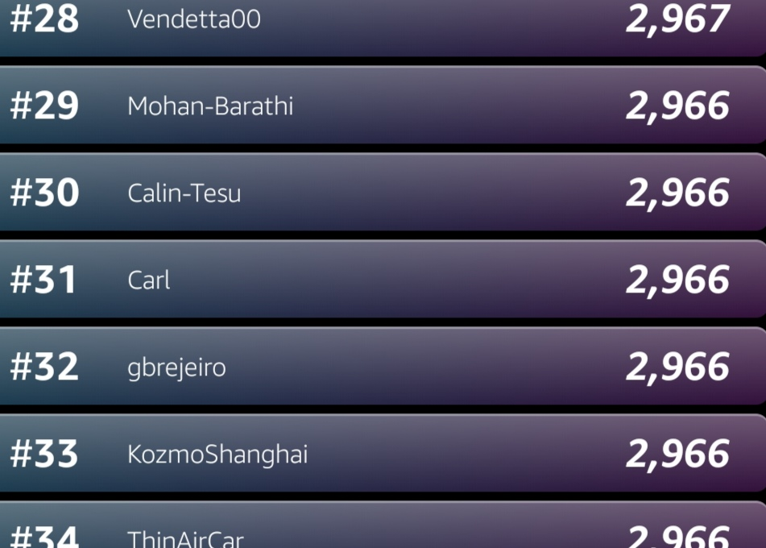
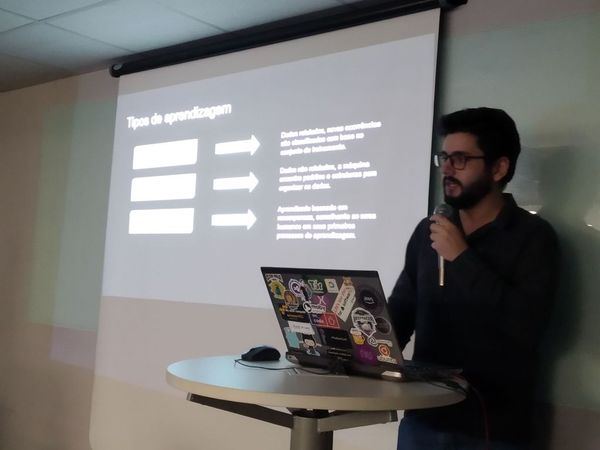

## A chance de conseguir uma bolsa de estudos da Udacity

Desde minha decisão em mudar de área e entrar de cabeça no mundo da ciência de dados, sempre ouvi falar dos cursos da Udacity, os famosos NanoDegrees da Universidade do Vale do Silício. Eis que surgiu a oportunidade de concorrer a uma bolsa de estudos, participando de uma competição de Reinforcement Learning com carros autonomos, organizada pela AWS. Naquele momento, ao ler as regras e tentar entender que teria de aprender Reinforcement Learning para concorrer a uma bolsa de Machine Learning, eu não imaginei que ganharia muito mais do que conhecimento durante essa trajetória.

## Descobrindo que para competir não seria exatamente de graça, o que fazer?

Ao começar a competição, assistir aos videos introdutórios e colocar o primeiro modelo para treino, veio a primeira surpresa, um e-mail informando que eu ja tinha atingido quase todo o uso gratuito da minha conta. 
Percebi que essa competição envolvia usar os serviços da AWS e que isso não era de graça, mas que existiam algumas maneiras de conseguir alguns créditos (e evitar gastar mais na competição do que o próprio valor do NanoDegree). Depois de muito pesquisar descobri que, por ser estudante, era possível criar uma conta no github e ganhar $100 de créditos na AWS, somados aos $30 recebidos por novos usuários, seriam $130 de créditos, uma bela ajuda pros treinos do modelo.

## Erros, acertos e uma grande comunidade disposta a ajudar

Comecei meus treinos enquanto aprendia o que significava cada "hyperparameter" do meu modelo, mas precisava de mais informações. Encontrei bons blogs, com bastante conteúdo e até mesmo modelos de função recompensa. Veio então os canais do Slack, canais da própria comunidade da Udacity, como também de competidores gabaritados da AWS DeepRacer. Toda essa comunidade deu um novo significado pra competição, muitas dúvidas sanadas e um ambiente de compartilhamento de informação que tornou o aprendizado muito prazeroso.

## Aprendendo sobre json e como alterar a velocidade no S3
No começo do aprendizado por reforço, uma das maneiras do modelo aprender de forma eficiente, como acontece com a gente, foi começando com calma. No que diz respeito ao carro autonomo, isso significa utilizar velocidades reduzidas durante a aprendizagem. 
O que eu não esperava é que, ao escolher a velocidade inicial, esses valores não podem ser alterados diretamente no console, foi quando aprendi sobre o S3 (descobri que funciona como o HD virtual) e sobre arquivos JSON (que até então eu não sabia nem que existia). Abrindo esse arquivo era possivel alterar esses valores de velocidade e futuramente descobri o que é um arquivo JSON e por que parecia realmente simples de entender cada linha dele.

## Fim do primeiro mês, grandes espectativas e frio na barriga

O último dia da competição (no primeiro mês) foi realmente intenso, eu ja queria estar entre o top 50 e garantir a minha bolsa de estudos, faltando um dia fui ultrapassado por diverss competidores e descobri que isso era normal no ultimo dia. Como toda competição, inclusive do kaggle, isso costuma acontecer mas, mesmo assim, consegui garantir o top 50 do primeiro mês, do segundo mês e ainda o top 50 da competição inteira.

## Objetivo atingido e um convite inusitado

Continuei competindo mesmo depois de garantir minha bolsa no mês de agosto e então fui surpreendido por um convite do grupo da AWS User Group São Paulo, perguntando se eu gostaria de falar sobre a AWS DeepRacer. Eu fiquei realmente animado e aceitei o convite, foi uma excelente noite e gostei muito da receptividade da comunidade.

