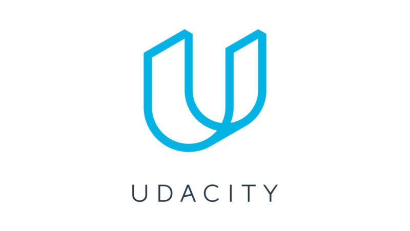
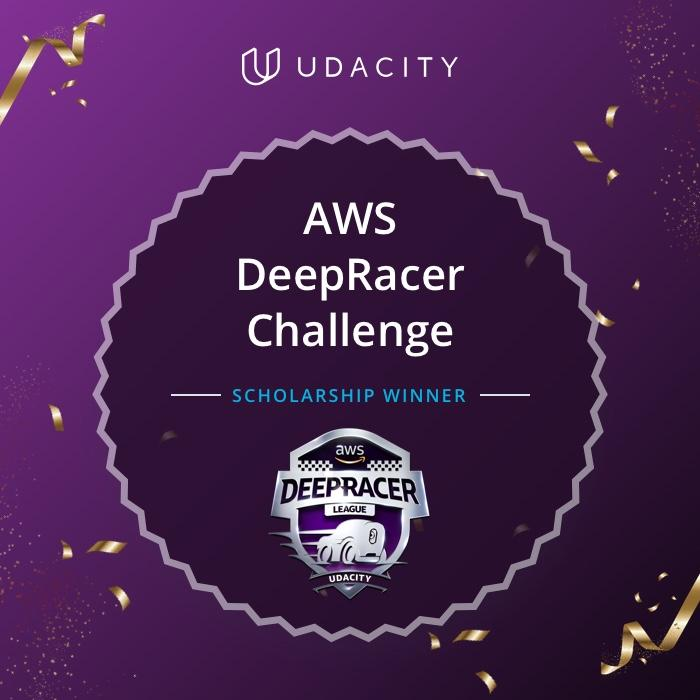

## A chance de conquistar um NanoDegree de Machine Learning Engineer

Desde minha decisão em mudar de área e entrar de cabeça no mundo da ciência de dados, sempre ouvi falar dos cursos da Udacity, os famosos NanoDegrees da Universidade do Vale do Silício. 

Eis que surgiu a oportunidade de concorrer a uma bolsa de estudos participando de uma competição de Reinforcement Learning com carros autônomos, organizada pela AWS. Naquele momento, ao ler as regras e entender que teria de aprender Reinforcement Learning para concorrer a bolsa, eu não imaginei que ganharia muito mais do que conhecimento durante essa trajetória.

## Descobrindo que para competir não seria exatamente de graça, o que fazer?

Ao começar a competição, assistir aos vídeos introdutórios e colocar o primeiro modelo para treino, veio a primeira surpresa, um e-mail informando que eu já havia atingido quase todo o uso gratuito da minha conta. 
Percebi que essa competição envolvia usar os serviços da AWS e que isso não era de graça, mas que existiam algumas maneiras de conseguir alguns créditos (e evitar gastar mais na competição do que o próprio valor do NanoDegree). Depois de muito pesquisar descobri que, por ser estudante, era possível criar uma conta no github e ganhar $100 de créditos na AWS, somados aos $30 recebidos por novos usuários, seriam $130 de créditos, uma bela ajuda de custo para os treinos do modelo.

## Erros, acertos e uma grande comunidade disposta a ajudar

Comecei meus treinos enquanto aprendia o que significava cada "hyperparameter" do meu modelo, mas precisava de mais informações. Encontrei bons blogs, com bastante conteúdo e até mesmo modelos de função recompensa. Veio então os canais do Slack, canais da própria comunidade da Udacity, como também de competidores gabaritados da AWS DeepRacer. Toda essa comunidade deu um novo significado para a competição, muitas dúvidas sanadas e um ambiente de compartilhamento de informação que tornou o aprendizado muito prazeroso.

## Fim do primeiro mês, grandes espectativas

O último dia da competição (no primeiro mês) foi realmente intenso, eu já queria estar entre os top 50 e garantir a minha bolsa de estudos, faltando um dia fui ultrapassado por diversos competidores. Eventualmente descobri que em fins de competições é normal uma quantidade massiva de entradas, não apenas na DeepRacer, mesmo assim consegui garantir o top 50 do primeiro mês e no segundo mês.

 
 
 
 

## Objetivo atingido e um convite inusitado

Continuei competindo mesmo depois de garantir minha bolsa no mês de agosto e então fui surpreendido por um convite do grupo da AWS User Group São Paulo, perguntando se eu gostaria de falar sobre a AWS DeepRacer. Eu fiquei realmente animado e aceitei o convite, foi uma excelente noite e gostei muito da receptividade da comunidade.

