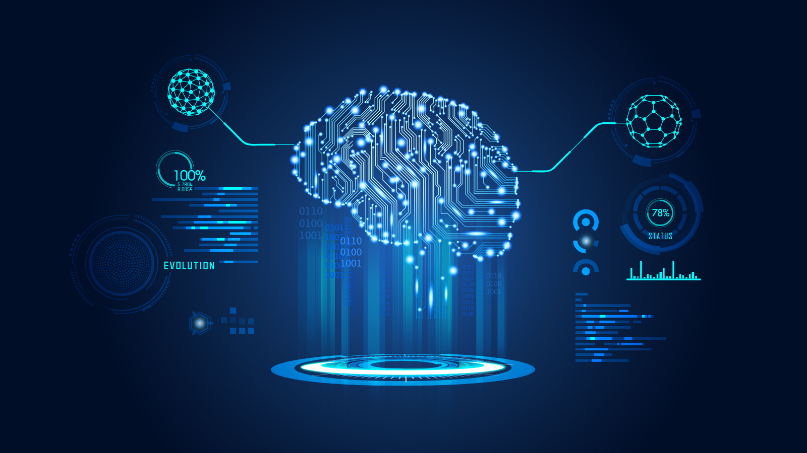

Uma das lições mais valiosas que aprendi nos últimos tempos é que ensinar e se preparar para ensinar são formas 
formidáveis de absorver o conhecimento. Vou começar uma série de posts explicando um pouco sobre como funciona os principais algoritmos que 
venho aprendendo, em todos os cursos, especializações e nanodegrees que vou passando.

Por falar em cursos, especializacões e nanodegrees, eu bebi de muitas fontes diferentes e cada uma lapidou um pouco 
os meus conhecimentos em Machine Learning.

Como eu contei no post sobre minha trajetória e como os dados sempre me conquistaram, foi nesse caminho que obtive muitas 
fontes de conhecimento. Vim de uma formação em engenharia e uma especialização em Lean Six Sigma, portanto durante a faculdade eu tive forte contato com cálculos e algebra e na especialização eu me aprofundei bastante em análise de dados por meio da estátistica e da probabilidade, o que me levou direto ao aprendizado de Machine Learning sem precisar obter esse base matemática.

Machine Learning pode ser caracterizado por modelos supervisionados e não supervisionados, vou tentar dar uma breve explicação sobre qual a diferença entre esses dois mundos.

## Modelo Supervisionado
 

Nesse tipo de modelo, nós informamos ao algoritmo qual a variável de saida e quais as variáveis de entrada que ele vai utilizar. 

Por exemplo, uma base de dados com diversos apartamentos da região, com a quantidade de banheiros, quantidade de quartos, quantidade de áreas de lazer e o preço de cada um desses apartamentos. Com base em todos os atributos (as variáveis de entrada x do nosso modelo), o modelo irá prever o preço de um apartamento naquela determinada região (a variável de saida y do nosso modelo).

## Modelo Não Supervisionado

Nesse caso o próprio algoritmo vai identificar padrões desconhecidos entre os dados e agrupa-los, sendo possível extrair importantes métricas de bases de dados gigantescas. 

Um exemplo seria uma base de dados médicos, com idade, sexo, rotina e etc, com poucos dados seria muito dificil concluir que a rotina x interfere na saúde de um individuo y mas se um milhão de individuos com rotinas parecidas sofrem de problemas muito parecidos, então encontramos um padrão importante a ser analisado

## Principais algoritmos de ML

* Regressão
* Classificação
* Decision Trees
* Random Forest
* Naive Bayes
* K Nearest Neighbours (KNN)
* K Means
* Support Vector Machines

