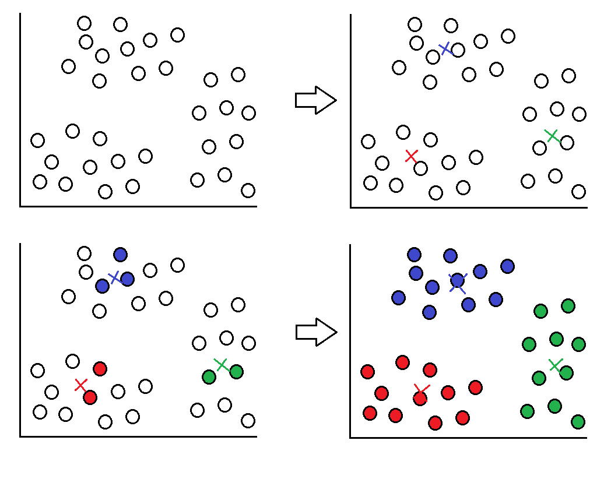

## Agrupamento não supervisionado

Esse é um algoritmo não supervisionado, portanto fornecemos a base de dados sem rótulos e o próprio algoritmo vai se organizando, levando em conta as similaridades dos dados e a quantidade de k especificados.

Na imagem abaixo, o valor escolhido para o k foi igual a 3. De forma aleatória, são escolhidos três pontos e então os pontos mais próximos vão sendo assimilados por aquele k, ao mesmo tempo que a cada assimilação o centro do cluster vai se locomovendo. No fim, os itens do banco de dados são separados dentro de cada categoria e o centro do cluster se estabiliza, pronto para novos dados de entrada.

  

