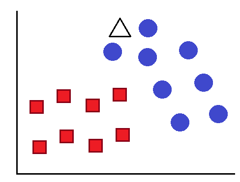

## K vizinhos mais próximos

Esse algoritmo gera rapidamente o caminho mais curto entre dois pontos, não que seja sempre o ideal. Utilizando a base de dados para treino e a quantidade de vizinhanças que o modelo deve criar, ele separa os dados em regiÕes e quando alimentamos com um novo dado de entrada, esse dado vai fazer parte da regiào a qual ele estiver mais próximo

Aqui podemos ver de forma ilustrada como o algoritmo separou os dados, pelas suas características, em quadrados vermelhos e bolinhas azuis. Ao colocar esse modelo para prever a categoria do triângulo, pela quantidade de k vizinhos que especificarmos, o algoritmo vai medir a distância de k elementos e decidir em qual categoria o novo elemento se encaixa, nesse caso ele será uma bolinha azul

Já nesse segundo caso, qual seria a categoria do triângulo? 

Bem, tudo vai depender da quantidade k que especificarmos, se for 1, será uma bolinha azul pois é o elemento mais próximo, se for 4 será um quadrado vermelho pois nas vizinhanças mais próximas do triângulo, três são quadrados vermelhos.
  

OBS: A definição do número de k é arbitrária, valores baixos podem ser mais suscetiveis aos outliers porém valores muito altos criarão tantas categoriais que dificultará a previsão de novos dados.
