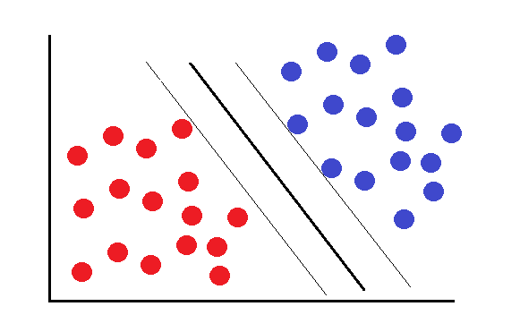
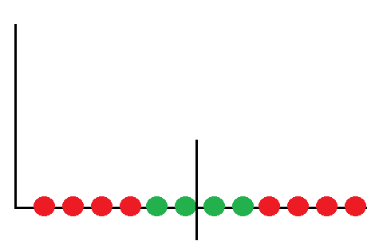
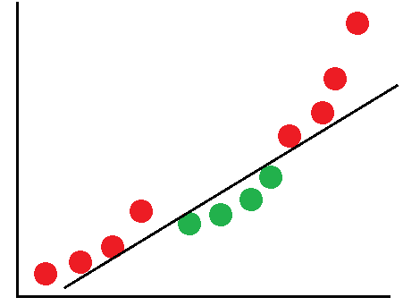

## O que é?

O SVM (Support Vector Machine) é um modelo de aprendizado supervisionado que separa dados por meio da identificação de padrões, sendo amplamente utilizado para problemas de classificação.
 

Quando os dados podem ser bem separados, como mostrado no exemplo acima, é relativamente simples classificá-los. No entanto, em casos mais complexos, como aqueles que envolvem a dosagem de um medicamento, a situação fica mais desafiadora. A dosagem não pode ser nem muito alta nem muito baixa; é necessário encontrar a quantidade ideal.

Nessas situações, a utilização do SVM com Kernel (que age como uma função para aumentar a dimensionalidade dos dados) pode solucionar o problema. Por exemplo, ele eleva todos os termos ao quadrado, o que resulta em uma melhor separação dos dados:

O SVM nos permite criar hiperplanos para a separação dos dados, margens que são menos afetadas por outliers e, com o truque do Kernel, ainda preservamos o poder computacional.

