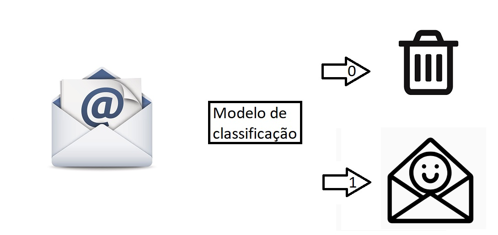

## Processo de Classificação

 O processo de classificação visa identificar a qual categoria uma nova entrada de dados pertence, com base em um conjunto de dados históricos.
 

Um exemplo comum seria o classificador de spam. Baseado em antigos registros, com palavras chave frequentemente usadas em e-mails de spam, ele identifica e separa categoricamente entre: spam, não spam.

 Outro exemplo poderia ser no ambiente médico, pela quantidade de genes que uma pessoa venha a ter, baseado em diversos casos anteriores, seria possível prever se há a necessidade de uma maior atenção e um maior número de exames. Com isso, muitos problemas médicos poderiam ser tratados logo de inicio, aumentando as chances de sucesso.

  

## Processo de Regressão

 Nesse processo

