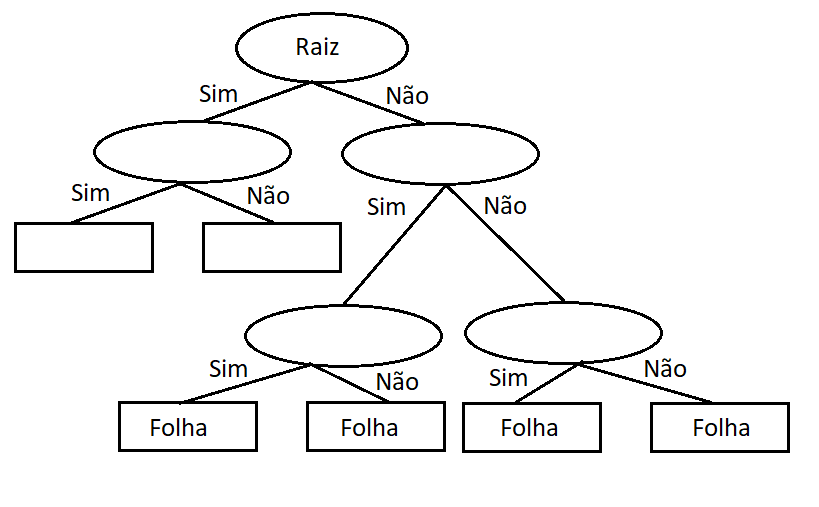
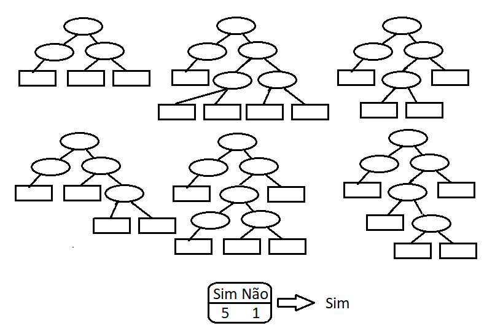

## Árvore de Decisão: O Que É?

Árvore de decisão tem um princípio bastante simples. Dadas certas regras e condições, ela segue um caminho específico, partindo da raiz até chegar às suas folhas. Elas podem ser usadas tanto para classificação quanto para regressão.

Na figura abaixo, podemos ver um exemplo de como funcionam, partindo da raiz do problema até suas folhas (embora a árvore, na verdade, fique de cabeça para baixo):
 

Uma árvore de decisão pode ter inúmeros ramos, dependendo do problema em questão. Por isso, é importante limitar a complexidade para evitar o overfitting, onde o modelo se ajusta demasiadamente aos dados de treinamento e não consegue generalizar para novos dados de entrada (é como decorar as respostas de uma prova sem realmente entender o conteúdo).
 

## Floresta Aleatória

Árvores de decisão são fáceis de criar, usar e interpretar, mas podem ter uma acurácia baixa, o que significa que elas não se saem bem com novos dados. Ter um bom desempenho apenas com os dados existentes não é muito útil na prática. É aqui que entra a floresta aleatória, que, como o nome sugere, é formada por várias árvores de decisão.

A floresta aleatória combina a simplicidade das árvores de decisão com um aumento significativo na acurácia proporcionado pela coleção dessas árvores. Para construir uma floresta aleatória, cada árvore é criada a partir de variáveis escolhidas aleatoriamente e combinadas entre si.

Imagine agora, com uma grande quantidade de árvores prevendo novas entradas, mesmo que algumas cometam erros na predição, o resultado final terá um número muito maior de acertos.

	
	

