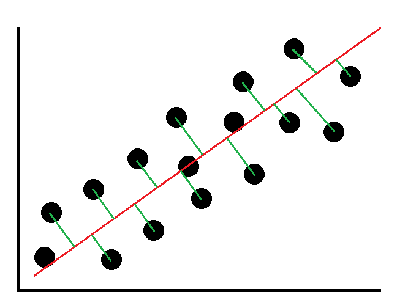
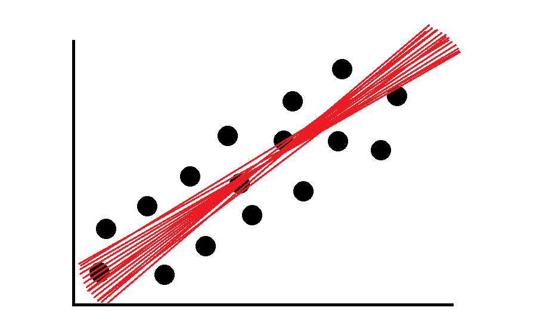
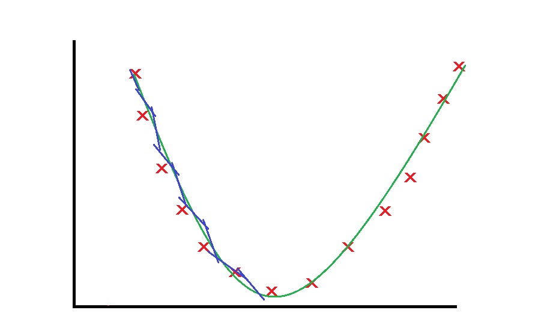
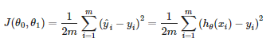
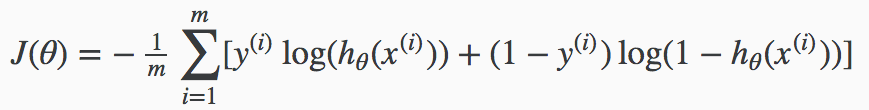

## Função custo

 Em um gráfico correlacionando duas variáveis, a reta não cortará todos os pontos. Portanto, o objetivo será acertar o máximo possível com a reta escolhida.

 Conforme a ilustração a seguir, podemos ver a distância entre a reta utilizada para prever o valor e o ponto que de fato era o valor, essa diferença entre o valor real e o valor previsto é utilizada para o cálculo de uma função de custo.

Mas como saber se essa reta é a ideal? Talvez um pouco mais para baixo ela me desse um valor mais próximo do real para todas as medições, talvez um pouco mais para cima, como descobrir? É ai que entra o gradiente descendente

 O gradiente descendente é formado por cada possível linha que se encaixaria no modelo, todas as inúmeras possibilidades. Cada uma das linhas gera um custo e com todos esses valores plotamos um novo gráfico.

Exemplo de inúmeras possibilidades

Cada ponto do gráfico é o resultado da função de custo de cada reta, no seu ponto mais baixo está o valor que representa a reta da função com o melhor acerto do modelo, portanto utilizamos o gradiente descendente para encontrar esse ponto

A função de custo é utilizada tanto para regressão linear quanto para regressão logística, seguem o mesmo conceito mas possuem fórmulas diferentes, conforme imagem abaixo:

Função de custo para regressão linear

	
Função de custo para regressão logística

Essa diferença de funções acontece, pois no caso da regressão logística, nossas variáveis de saída são binárias e, se utilizarmos a função de custo para regressão linear, o plot do gradiente descendente será não convexo, ocasionando diversos pontos de mínimo, ocultando o mínimo real.

	

