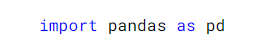

## MatplotLib, o que é?

Matplotlib é a biblioteca de graficos do Python, um módulo bastante utilizado dessa biblioteca por cientista de dados é o pyplot
 

Como boa prática, ao importar o o matplotlib.pyplot daremos um apelido para ele:

