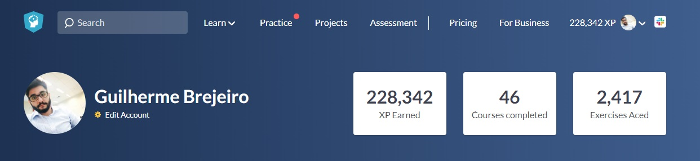
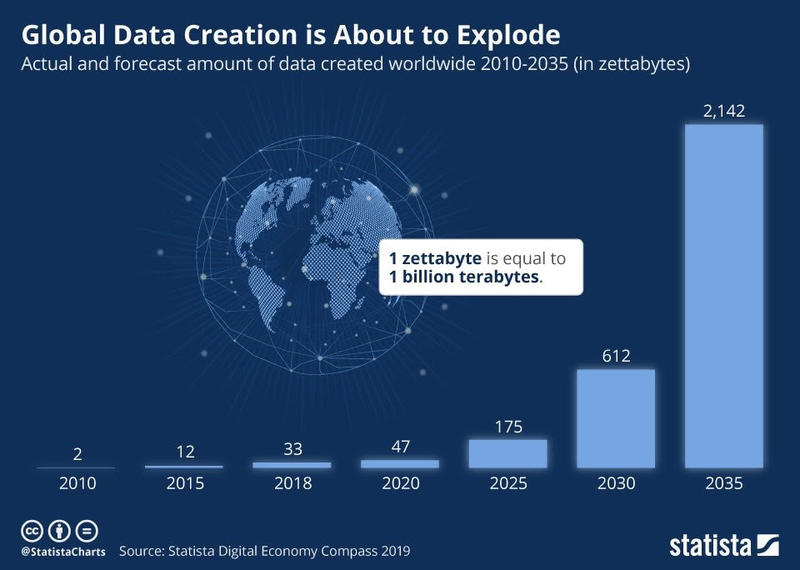

Eu vim de áreas analíticas, lidando com gráficos, obtenção de dados e melhoria de processos na área de qualidade e na área de logística.
 

Formado em engenharia, me especializei como Black Belt em Lean Six Sigma e inconscientemente eu já caminhava para o mundo dos dados.

## Descobrindo a ciência dos Dados

Estudei por um ano MBA em gestão de negócios e ao mesmo tempo cursava um Micro Master em Supply Chain na EDX, no qual tive um módulo  sobre Machine Learning e, em uma determinada aula do meu MBA, me foi apresentado um [vídeo](https://youtu.be/jbkSRLYSojo) do Hans Rosling contando a historia de 200 países por 200 anos em 4 minutos. Entrei em contato com ele e questionei sobre os caminhos para atuar nessa área, estava nascendo a minha decisão de ser cientista de dados, finalmente havia me encontrado na profissão.

## Encarando o desafio de me especializar por MOOCs

Decidido o caminho que viria a tomar, estava na hora de estudar de maneira intensa e separei 6 meses para me dedicar a isso.

Sabia que teria de estudar muito, mas com a vantagem de não precisar me focar tanto em cálculo, álgebra, estatística e probabilidade, devido as minhas formações. Portanto, apenas revisei o conteúdo e parti para cursos mais específicos. Essa é a relação dos cursos que eu fiz e ainda estou fazendo:

## Python
  * Python: Mundo 1, Mundo 2 e Mundo 3 - [Gustavo Guanabara](https://www.youtube.com/user/cursosemvideo) - Concluído
  * [Python: Fundamento para Análise de Dados - DSA](https://www.datascienceacademy.com.br/course?courseid=python-fundamentos) - Concluído
  
## Big Data  
  * [Big Data: Fundamentos 2.0 - DSA](https://www.datascienceacademy.com.br/course?courseid=big-data-fundamentos) - Concluído
  * [MBA em Big Data & Data Science - PUC](https://www.pucminas.br/PucVirtual/Pos-Graduacao/Paginas/Ci%C3%AAncia-de-Dados-e-Big-Data.aspx?moda=1&polo=1&area=11&curso=2944&situ=1) - Cursando
  
## Udemy
  * [Machine Learning A-Z - Kirill Eremenko/Udemy](https://www.udemy.com/course/machinelearning/) - Concluído
  
## Coursera
  * [Machine Learning - Stanford/Coursera](https://www.coursera.org/learn/machine-learning) - Concluído
  * [Deep Learning Specialization - deeplearning.ai](https://www.coursera.org/specializations/deep-learning) - Concluído
  
  
## AWS DeepRAcer, competi e conquistei um NanoDegree patrocinado pela Amazon

  * [NanoDegree em Machine Learning Engineer - Udacity](https://www.udacity.com/course/machine-learning-engineer-nanodegree--nd009t) - Cursando com bolsa de 100%, premiação por ser TOP 50 Mundial da AWS DeepRacer/Udacity
  
 
 
 

## DataCamp   

Apesar de alguns projetos práticos, eu senti a necessidade de codar mais e então conheci a DataCamp, foi uma excelente maneira de variar entre teoria e prática, realizando duas Tracks com quase 50 módulos e 150 horas, a plataforma vai te dando pontos a cada etapa concluída e isso estimula bastante, é quase como um jogo.

  * [Career Track - Machine Learning Scientist with Python](https://www.datacamp.com/tracks/machine-learning-scientist-with-python) - Concluído
  * [Career Track - Data Scientist with Python](https://www.datacamp.com/tracks/data-scientist-with-python) - Concluído

## Hello World!

É incrível o que se pode atingir com bastante dedicação e foco, desenvolvi diversos projetos em cada um dos cursos e ainda desenvolvo projetos na DataCamp e Kaggle. Fico cada dia mais maravilhado com o potencial que a ciência dos dados tem pela frente e me perco nos pensamentos ao imaginar como estaremos dentro de alguns anos! 

 

