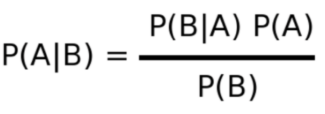
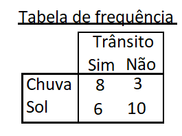

## Conceito

O algoritmo Naive Bayes, como é de se imaginar, é baseado no teorema de Bayes. Muito utilizado para classificar texto conforme a ocorrência da palavra, ou para predizer um fenômeno conforme outros fatores venham a acontecer.

Naive Bayes nos dá uma probabilidade de um fenômeno acontecer, dato outro fenômeno tenha acontecido, como por exemplo a probabilidade de ter trânsito dado que está chovendo, ou dado que está sol, e assim por diante.

Está é a formula do teorema:
 

Ela nos fornece a probabilidade de acontecer o evento B, dado que aconteceu o evento A.

Para isso, vamos multiplicar a probabilidade de acontecer o evento A dado o evento B, pela probabilidade de acontecer o evento A e dividir essa multiplicação pelo probabilidade de acontecer o evento B.

Utilizando o evento do tempo X trânsito, qual a probabilidade de ter trânsito dado que está chovendo?

Nessa tabela temos a frequência de ocorrências de transito quando choveu e quando fez Sol, para responder a pergunta primeiro vamos calcular a probabilidade de chover quando tem trânsito, em seguida a probabilidade de chover e por fim a probabilidade de ter trânsito

Teremos esses valores:
* Total de frequências medidas: 27
* P(B|A): 8/14 = 0.571
* P(A): 11/27 = 0.407
* P(B): 14/27 = 0.518

Portanto, a probabilidade de trânsito caso esteja chovendo (P(A|B)) é (0.571 * 0.407) / 0.518 = 0.449 ou 44,9%

 Exemplo bastante fictício se você mora em SP, por que o trânsito é uma constante 

