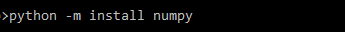
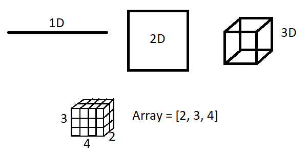
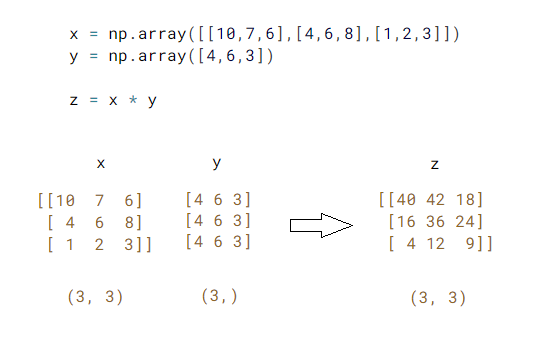
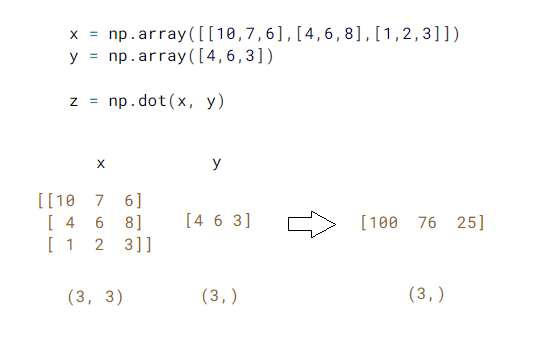
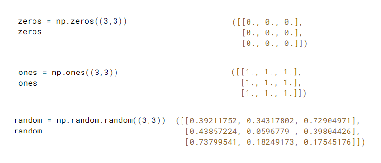

## O que é NumPy?

Quando os modelos matemáticos começaram a exigir um poder computacional significativo, surgiu a necessidade de uma biblioteca que permitisse trabalhar com arranjos, vetores e matrizes de N dimensões. Assim nasceu o NumPy, a principal biblioteca científica do Python, equiparável ao software proprietário Matlab. O NumPy foi implementado em C, o que proporciona alta velocidade nas operações matemáticas.

Para usar essa biblioteca, é necessário instalá-la. No Windows, após a instalação do Python, você pode abrir o prompt de comando como administrador e digitar o seguinte comando:

Após a conclusão da instalação, basta fechar o prompt de comando e você poderá usar o NumPy no Python com o seguinte comando: `import numpy`

Como acontece com todas as bibliotecas, é possível atribuir um apelido a ela. Uma boa prática ao usar o NumPy é apelidá-lo como `np`:

Com o NumPy importado, podemos criar arrays, como mostrado nos exemplos de arrays 1D e 2D:

No exemplo, uma lista de elementos é criada e depois transformada em um array. Isso oferece várias vantagens para trabalhar com esses números:

Com um array, o cálculo de operações matemáticas em cada item é muito mais rápido. No exemplo, você pode ver uma lista multiplicada por um número e um array multiplicado pelo mesmo número. No segundo caso, cada valor é multiplicado individualmente:

Podemos visualizar sequências numéricas em uma dimensão (1D) e também trabalhar com 2D, 3D e nD. Visualmente, fica mais difícil de representar, mas o NumPy se torna uma ferramenta incrível e extremamente rápida para lidar com uma grande quantidade de números, devido a essas execuções simultâneas em várias dimensões:

Com quatro dimensões, podemos imaginar um array contendo diversos arrays de três dimensões.

No exemplo abaixo, a multiplicação de matrizes é realizada sem a função específica do NumPy. O NumPy expande os arrays e executa as operações matemáticas:

Utilizando a função "dot," conseguimos efetuar a multiplicação dos arrays da maneira correta, conforme a álgebra linear:

Abaixo, estão algumas outras funções do NumPy que permitem gerar matrizes com todos os elementos 0, 1 ou com valores aleatórios. Essas funções são muito úteis em algumas aplicações:

