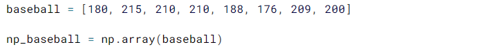
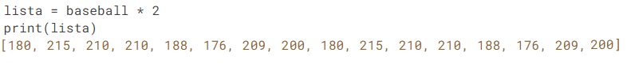
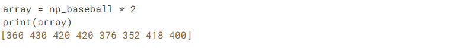

## O que é NumPy?

Quando os modelos matemáticos começaram a demandar um poder computacional muito grande, viu-se a necessidade de uma biblioteca que permitisse trabalhar com arranjos, vetores e matrizes de N dimensões, assim nasceu o NumPy, a principal biblioteca científica do Python e que se equipada com o software proprietário Matlab. NumPy foi implementado em C, por isso sua grande velocidade na realizações das operaçÕes matemáticas.

Para a utilização dessa biblioteca, há a necessidade de instalação. No windows, já com o Python instalado, abra o prompt de comando em modo administrador e digite: 

## python -m install numpy

Terminado a instalação, basta fechar o prompt de comando e já é possível utilizar o NumPy junto ao Python, basta utilizar o comando: import numpy

Como todas as bibliotecas é possível utilizar um apelido para a mesma, uma boa prática ao utilizar numpy é apelida-lo de np:

	

Com o NumPy importado, já é possível criar arrays, abaixo o exemplo de 1D e 2D:

Nesse exemplo, foi criado uma lista de elementos e em seguida ela foi transformada em um array, com isso ganhamos muitas vantagens para trabalhar com esses números

	

Com esse array, trabalhar com elementos matemáticos em cada item se torna muito rápido. No exemplo, é possível ver uma lista multiplicada por um dado número e um array multiplicado por esse número, no segundo caso cada valor é multiplicado individualmente:

	

	

