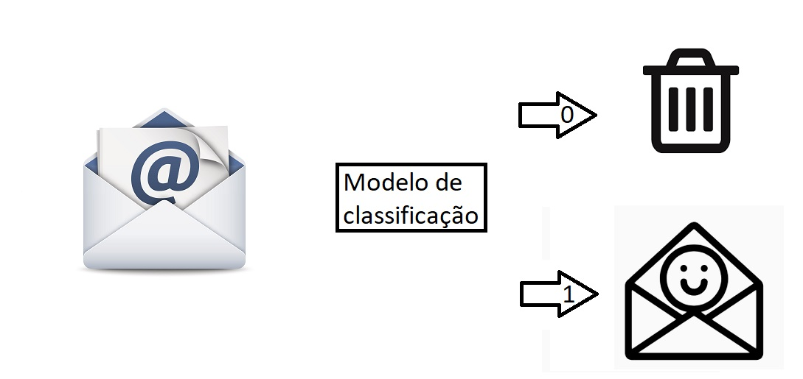
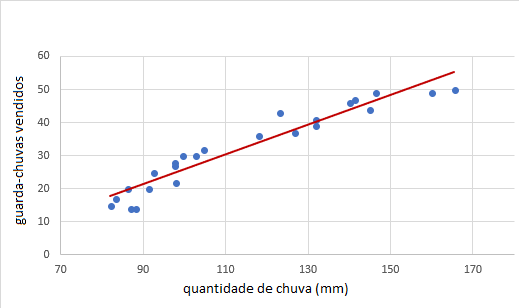
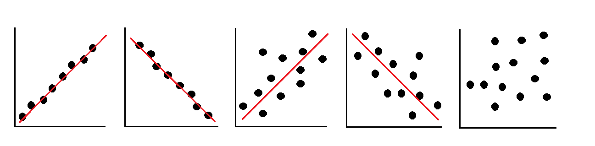
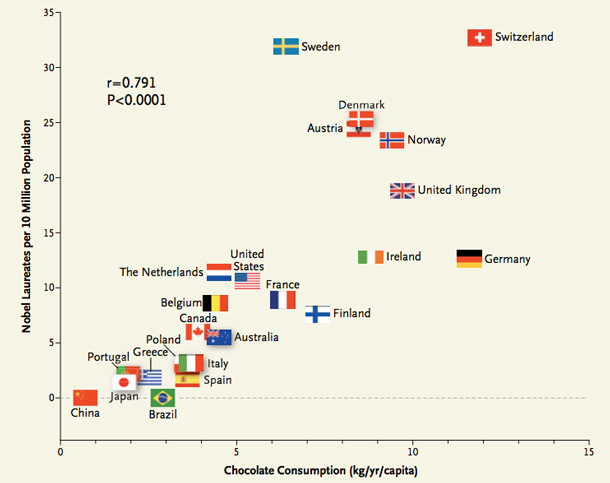
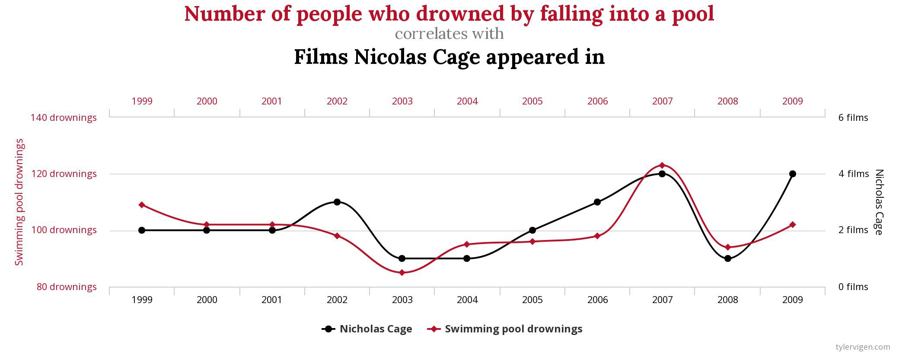
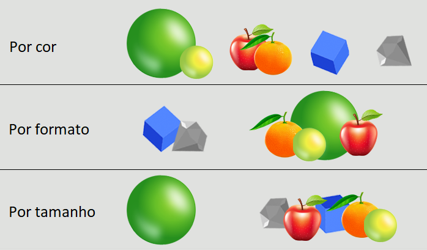

## Processo de Classificação

 O processo de classificação visa identificar a qual categoria uma nova entrada de dados pertence, com base em um conjunto de dados históricos.
 

Um exemplo comum seria o classificador de spam. Baseado em antigos registros, com palavras chave frequentemente usadas em e-mails de spam, ele identifica e separa categoricamente entre: spam, não spam.

## Processo de Regressão

 Diferente do processo anterior que da uma resposta categórica se é ou não é, nesse processo o objetivo é prever o comportamento futuro baseado nos critérios conhecidos. Um bom exemplo seria a venda de guarda chuvas, através da quantidade de chuva é possível prever a demanda que vai acontecer, com isso organizar o nível de estoque e pedidos, não tentamos responder de forma categórica se vai ou não ser vendido guarda chuvas mas sim a quantidade.

 

 

O exemplo anterior possui apenas uma variável, sendo considerado um modelo de Regressão Linear Simples, existem modelos mais complexos como de Regressão Linear Multipla e Regressão Logistica. Futuramente vou dedicar um post para explica-las.

  
## Correlação

Saber se duas variáveis são correlacionadas, isto é, ao alterar uma das variáveis a outra sofre influência, basta plotar um gráfico e de formar bastante intuitiva é possível identificar.

Na imagem a seguir, da direita para a esquerda, são exemplos de: 
  * forte correlação positiva
  * forte correlação negativa
  * correlação positiva moderada
  * correlação negativa moderada 
  * nenhuma correlação
  
 

  
  
  
## Correlação não implica em causalidade

 Uma frase clássica da estátistica é que "Correlação não implica é causalidade", isso significa que não basta apenas elaborar um gráfico com duas ou mais variáveis e sair prevendo dados. Aqui, a importância do conhecimento do negócio se mostra primordial.

Um exemplo disso é uma públicação cientifica, feita por um médico chamado Franz Messerli, no qual ele relaciona o consumo de chocolate com a quantidade de prêmios Nobel recebidos por país. 

Olhando o gráfico realmente é impressionante, vamos encher todo mundo de chocolates e levar a humanidade para um novo patamar!

O que não foi analisado e passou batido foram outras variáveis. O fato de que quanto maior a renda, maior o nível de estudo e maior o poder aquisitivo para compra de chocolate; ou o tamanho do país, EUA possui uma produção cientifica altíssima mas tambem possui uma população muito superior a Noruega, por exemplo. Ai está um exemplo de como é importante conhecer o negócio.

 

 

 Outro exemplo, bastante gritante e muito utilizado, é a relação existente entre a quantidade de filmes do Nicolas Cage e a quantidade de mortes por afogamento em piscina

 

 

## Processo de Clusterização

 Falando um pouco de aprendizagem não supervisionada, vem os processos de clusterização. Basicamente, nesse processo, o algoritmo procura caraterísticas semelhantes, dividindo em pequenos grupos, esse número de grupos varia e é um parâmetro que nós precisamos especificar manualmente.

Como exemplo, vamos imaginar a organização dos produtos em um supermercado. Pode ser feito pelo preço, pela marca, pelo local de uso, pela data de validade, pela cor, etc. 

No caso da clusterização, alguns exemplos dessa organização pode ser:

* Baseada no centróide
* Baseada na conectividade
* Baseada na densidade

	

  
  
  	

