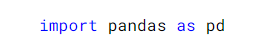
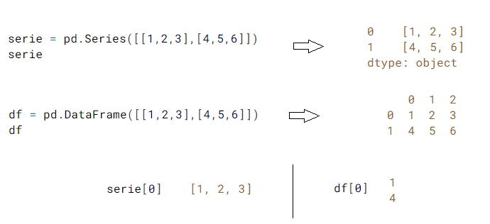
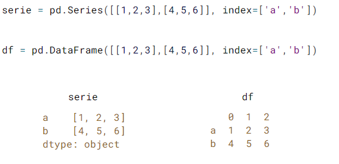
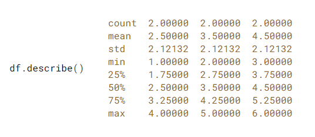
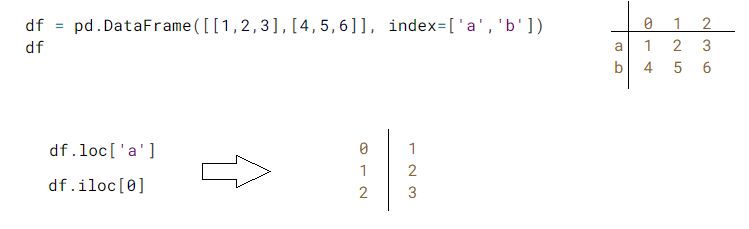
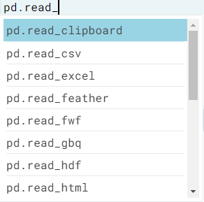
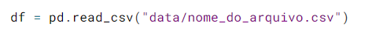
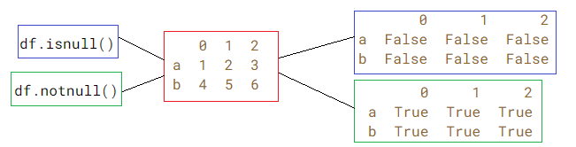
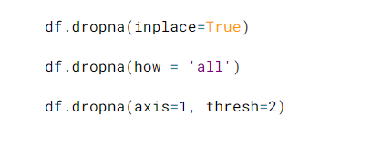

## Trabalhando com Pandas 

Uma importante biblioteca do PYthon é o Pandas, com ele é possível importar, manipular e visualizar dados de forma extremamente prática e muitas vezes intuitiva

Como boa prática, ao importar o pandas daremos um apelido para ele:

## Series e DataFrame

Os tipos principais de estrutura de dados no Pandas é uma Series, que é como um arranjo unidimensional e um DataFrame, que é uma estrutura bidimensional de dados, parecido com uma planilha no Excel

Podemos observar que a primeira coluna de indice veio preenchida com valores sequenciais automaticamente, mas podemos altera-los acrescentando o campo de index

## Stats

O Pandas nos fornece diversas facilidades analiticas dos dados, com facilidade podemos ter estátisticas do nosso DataFrame utilizando .describe()

## Localizando valor

Duas maneiras bastante comuns de localizar valores em um DataFrame: .loc e .iloc

loc: referenciado pelos rótulos das linhas e colunas
iloc: referenciado pelos indices

No caso abaixo, aplicando ambos de forma a trazer a o mesmo resultado:

## Importando dados

Outra função muito importante e muito utilizada no Pandas é a importação de dados, como txt, csv, entre outros

Alem de importar os dados, é possível durante a mesma linha de comando ja especificar o nome das colunas, limpar e até substituir valores nulos

## Preparando os dados

Depois de importar o dataset com os dados que serão analisados, antes de qualquer coisa é importante prepara-los e limpa-los, pois se dados ruins entram no modelo de ML então dados ruins sairão do modelo de ML

Podemos verificar se existem valores nulos e valores não nulos com as funçÕes .isnull() e .notnull(), elas retornarão valores boolianos, True ou False.

Outra função extremamente utilizada é .dropna(), ela permite descartar uma coluna ou uma linha que possua valores nulos. Quando são poucos valores, simplesmente descarta-los não vai causar grandes problemas no dataset, se a quantidade for muito alta, existem tecnicas para tentar minimizar esse problema

  * O argumento inplace, se verdadeiro fará com que os dados descartados sejam descartados do dataset que foi carregado, sobreponto o dataset anterior
  * how, se preenchido com all, descartará as linhas e colunas que são compostar completamente por valores nulos
  * thresh permite especificar a quantidade de valores nulos que deve existir para que seja ou não descartado a linha/coluna em questão
  * axis vem por padrão com o valor 0, com isso a função será executada levando em consideração que estamos nos referindo as linhas, caso seja alterado para 1, então a função passará a considerar o tratamento das colunas

