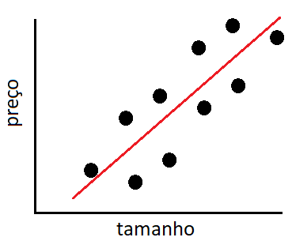
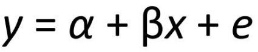
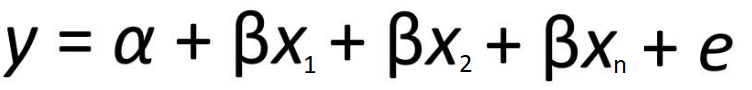

## Regressão Linear Simples

Quando precisamos estudar duas variáveis, esse é o tipo de regressão que pode ser utilizada. Nesse modelo, uma váriavel independente e uma variavel dependente podem ser plotadas para identificarmos suas relações e gerarmos uma linha que possa vir a explicar dados futuros, como por exemplo o preço de uma casa e o tamanho, conforme a figura.

Desse plot nós tiramos a equação da reta e o seu devido erro, que é a distância entre onde de fato está o ponto e a reta desenhada:

## Regressão Linear Multipla

Bastante parecida com a anterior, nessa regressão nós tentamos aumentar a precisão do modelo adicionando outras váriaveis que influênciam no valor de saída. Como no exemplo anterior, difícilmente podemos afirmar que o tamanho da casa é o unico fator que influência no valor para melhorarmos a precisão utilizamos a quantidade de cômodos, região, área externa, etc.

Parecida com a formula anterior, agora temos outras variáveis influênciando no valor de saída

OBS: Como podemos ver, é possível utilizar n varíaveis para prever o nosso modelo, porém não é aconselhavél utilizar variáveis colineáres, pois isso prejudica o modelo final.

	

	

