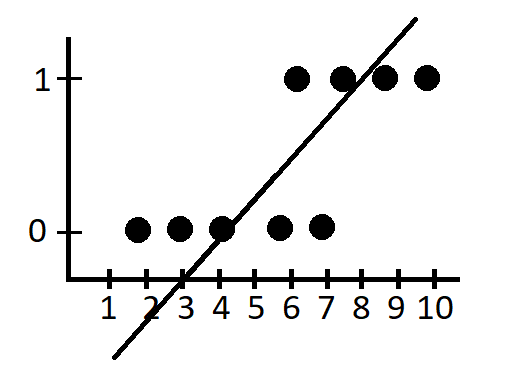
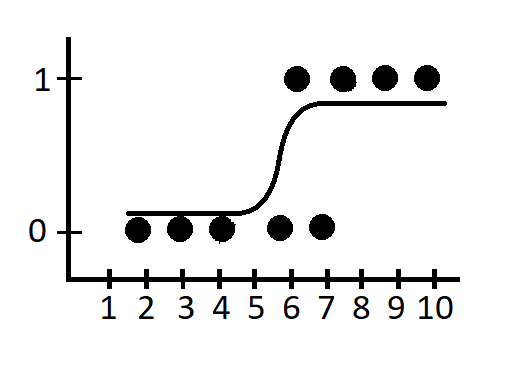

## Regressão Logística

Apesar do nome, este é um modelo usado para problemas de classificação. Como explicado anteriormente, nesse tipo de problema nós tentamos
prever uma resposta binária, como um sim ou não, certo ou errado e etc.

E qual o motivo de usar um modelo de regressão logistica ao invés de um modelo de regressão linear?

Variáveis binarias violam as regras da linearidade pois não temos uma resposta explicativa contínua e a regressão linear lida com valores que podem ser superiores a 1 e inferior a 0.

Aplicando uma regressão linear em um conjunto de dados binários, nosso modelo simplesmente não conseguiria prever novas entradas e, se essas entradas fossem baixas, teriamos valores caminhando para o negativo, o que não pode ocorrer.

Devido a esse problema na utilização de modelos lineares, se faz necessário a utilização de modelos de regressão logística.

Nesse caso, será necessário efetuar algumas alterações no modelo linear:
 * Utilização do sigmoid no teste de hipótese, uma equação que irá manter todos os valores dentro do range (0,1), portanto valores com percentual abaixo de 0.5 tem um resposta 0 e valores com percentual igual ou acima de 0.5 tem uma resposta 1. 
 * Utilização de uma [função de custo](https://guilhermebrejeiro.github.io/essays/funcao_custo.html), diferente da função utilizada em modelos lineares, exatamente por termos entradas binárias, sendo necessário um modelo matemático logarítmico, conhecido como entropia cruzada.

Feitas as alterações, o nosso modelo agora consegue prever uma resposta binária, sem ser prejudicado por valores extremamente altos ou baixos que possam vir a aparecer.

  
 
