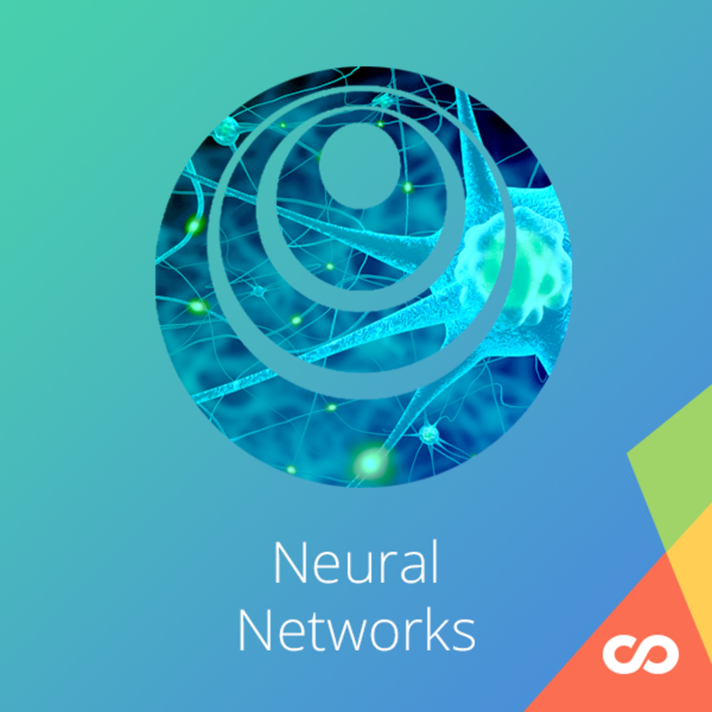

Projects:

<ul>
<li>Building your Deep Neural Network Step by Step</li>
 
<li>Deep Neural Network Application</li>
 
<li>Logistic Regression with a Neural Network mindset</li>
 
<li>Planar data classification with one hidden layer</li>

Source: <a href="https://github.com/GuilhermeBrejeiro/Deep-Learning-Specialization/tree/master/Neural%20Networks%20and%20Deep%20Learning"><i class="large github icon"></i>Neural Networks</a>
