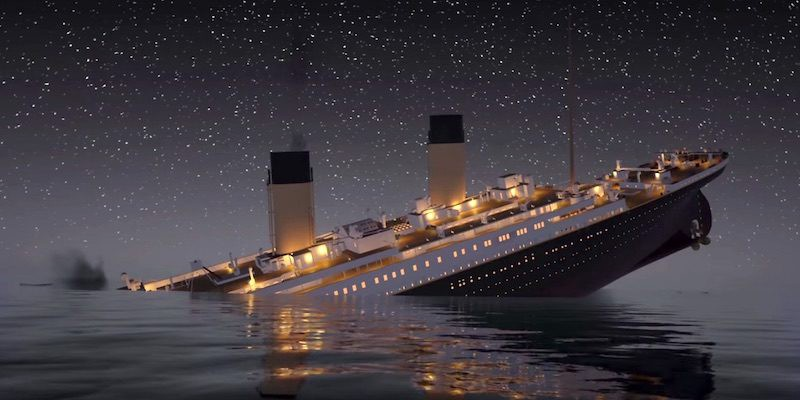

This is the legendary Titanic ML competition – the best, first challenge for you to dive into ML competitions and familiarize yourself with how the Kaggle platform works.

The competition is simple: use machine learning to create a model that predicts which passengers survived the Titanic shipwreck.

This was one of my first projects trying to find the best Age for the null values and then, applied using two different algorithnms.
 
Source: <a href="https://github.com/GuilhermeBrejeiro/Titanic"><i class="large github icon"></i>Titanic</a>
